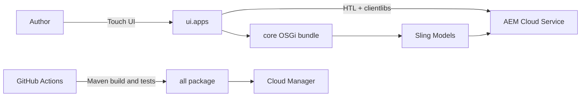

# AEM Component Library


Enterprise-grade Adobe Experience Manager component accelerator built with AEM as a Cloud Service, Sling Models, HTL, OSGi, Java 17, and Core Components. It is designed for AEM Developers, Java Developers, and Adobe Certified Developers who need a maintainable Cloud Manager delivery baseline.

## Project Structure

```text
core/                 Sling Models, services, and Java business logic
ui.apps/              Components, dialogs, clientlibs, and templates
ui.content/           Mutable sample content
ui.config/            OSGi configurations
all/                  Deployable aggregate package
docs/                 Architecture and component guides
.github/workflows/    GitHub Actions build validation
```

## Architecture



## Installation

Requirements: Java 17, Maven 3.3.9 or later, and an AEM as a Cloud Service SDK for local deployment.

```powershell
git clone https://github.com/prasanta/aem-component-library.git
cd aem-component-library
mvn clean install
```

## Build and Deployment

```powershell
# Build and test
mvn clean verify

# Deploy the aggregate package to a local author
mvn clean install -PautoInstallSinglePackage

# Deploy only the OSGi bundle
mvn clean install -pl core -PautoInstallBundle
```

Production deployments use the repository's Cloud Manager Full Stack Pipeline. No AWS, Azure, Vercel, or third-party server is required.

## Components

| Component | Implementation | Guide |
| --- | --- | --- |
| Text | Core Text v2 extension with RTE and styles | [Text guide](docs/component-guides/text-component.md) |
| Image | Core Image v3 extension with DAM and responsive delivery | [Image guide](docs/component-guides/image-component.md) |
| Button | Core Button v2 extension with link and style policies | [Button guide](docs/component-guides/button-component.md) |
| Hero Banner | Sling Model, background image, CTA, alignment | [Hero guide](docs/component-guides/hero-banner-component.md) |
| Accordion | Multifield items and disclosure interaction | [Accordion guide](docs/component-guides/accordion-component.md) |
| Tabs | Multifield panels and active tab | [Tabs guide](docs/component-guides/tabs-component.md) |
| FAQ | Multifield questions with optional search | [FAQ guide](docs/component-guides/faq-component.md) |
| Card Grid | DAM cards with 2/3/4-column variants | [Card Grid guide](docs/component-guides/card-grid-component.md) |

## Screenshots

Published and author screenshots belong under `docs/screenshots/`. Component-specific screenshot folders are referenced by each guide.

## Testing

Unit tests run in `core`; HTL and FileVault validation run while packaging `ui.apps`; GitHub Actions runs `mvn clean verify -DskipITs` on pushes, pull requests, and every Sunday.

## Git Strategy

```powershell
git switch -c feature/text-component
git switch -c feature/image-component
git switch -c feature/button-component
git switch -c feature/hero-banner
git switch -c feature/accordion
git switch -c feature/tabs
git switch -c feature/faq
git switch -c feature/card-grid
```

Use focused commits such as `feat(text): extend Core Text component`. Open pull requests into `main`, require the Actions build, squash merge approved work, and tag releases after Cloud Manager validation: `v1.0.0` for the initial accelerator, `v1.1.0` for compatible component enhancements, and `v2.0.0` for breaking API or content-structure changes.

## Roadmap

- Add component policy examples and editable template documentation.
- Add focused Sling Model unit tests for multifield mapping.
- Add Cypress coverage for author and published component behavior.
- Add accessibility and visual regression gates to the UI test module.